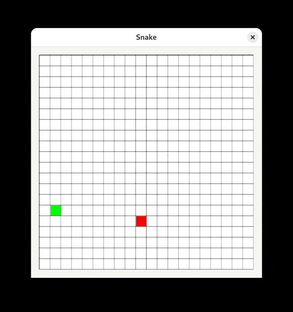

# Snake

A basic snake game written in C++.



## Building

This project depends on [gtkmm](https://gtkmm.gnome.org/) for user interface and [Meson](https://mesonbuild.com/) for building. After obtaining the dependencies, clone and enter the repository.

```sh
git clone https://github.com/lyuk98/snake.git
cd snake
```

Build the project using Meson.

```sh
meson setup build
cd build
meson compile
```

After building, the game can be started by running the executable.

```sh
./snake
```
